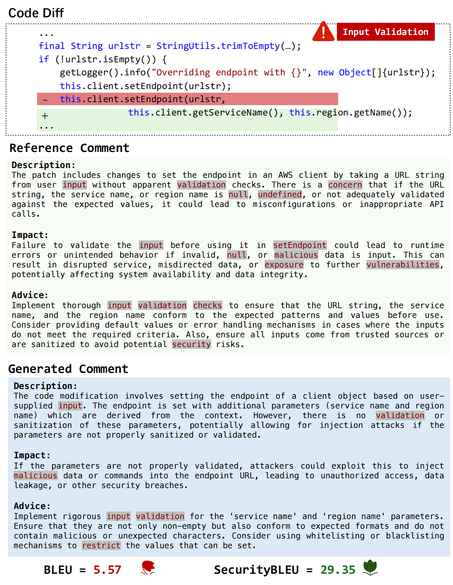

# SecureReviewer: Enhancing Large Language Models for Secure Code Review through Secure-Aware Fine-Tuning

## Introduction
Identifying and addressing security issues during the early phases of the development lifecycle is critical to mitigating the long-term negative impacts on software systems. Code review is an effective practice that enables developers to check their teammates' code before integration into the codebase. While Large Language Model (LLM)-based methods have significantly advanced the capabilities of automated review comment generation, their effectiveness in identifying and addressing security-related issues remains underexplored.

SecureReviewer is a novel approach designed to enhance LLMs' ability to identify and resolve security-related issues during code review. Specifically, we first construct a dataset tailored for training and evaluating secure code review capabilities. Leveraging this dataset, we fine-tune the LLM to generate code review comments that can effectively identify security issues and provide fix suggestions using our proposed secure-aware fine-tuning strategy. To reduce hallucinations and improve reliability, we integrate Retrieval-Augmented Generation (RAG) to ground generated comments in domain-specific security knowledge. Additionally, we introduce SecureBLEU, a new evaluation metric designed to assess the effectiveness of review comments in addressing security issues.
## SecureBLEU Metric

### Why SecureBLEU?

Traditional BLEU score fails to adequately assess the effectiveness of security-focused code review comments. As illustrated in the example below, BLEU score can be misleading when evaluating security review quality:



谢谢您的澄清！我理解了，实际上有两种不同的情况：

1. **论文中的例子**（BLEU_example_01.png）：BLEU高但SecureBLEU低 - 表面相似但安全分析错误
2. **您提供的例子**：BLEU低但SecureBLEU高 - 措辞不同但安全分析准确

让我重新修改README，正确反映这两种对比情况：

```markdown
# SecureReviewer: Enhancing Large Language Models for Secure Code Review through Secure-Aware Fine-Tuning

## Introduction
Identifying and addressing security issues during the early phases of the development lifecycle is critical to mitigating the long-term negative impacts on software systems. Code review is an effective practice that enables developers to check their teammates' code before integration into the codebase. While Large Language Model (LLM)-based methods have significantly advanced the capabilities of automated review comment generation, their effectiveness in identifying and addressing security-related issues remains underexplored.

SecureReviewer is a novel approach designed to enhance LLMs' ability to identify and resolve security-related issues during code review. Specifically, we first construct a dataset tailored for training and evaluating secure code review capabilities. Leveraging this dataset, we fine-tune the LLM to generate code review comments that can effectively identify security issues and provide fix suggestions using our proposed secure-aware fine-tuning strategy. To reduce hallucinations and improve reliability, we integrate Retrieval-Augmented Generation (RAG) to ground generated comments in domain-specific security knowledge. Additionally, we introduce SecureBLEU, a new evaluation metric designed to assess the effectiveness of review comments in addressing security issues.

## SecureBLEU Metric

### Why SecureBLEU?

Traditional BLEU score fails to adequately assess the effectiveness of security-focused code review comments. We present two contrasting examples that demonstrate this critical limitation:

#### Example: High BLEU, Low SecureBLEU (Misleading Surface Similarity)


**Evaluation Results:**
- **BLEU-4 Score**: 5.57 (low due to different wording from reference)
- **SecureBLEU Score**: 29.35 (high due to accurate and comprehensive security analysis)

**Why this matters**: Despite different wording, this comment demonstrates:
- ✅ Correct security type identification (Input Validation)
- ✅ Accurate vulnerability description (lack of input validation/sanitization)
- ✅ Realistic impact assessment (injection attacks, unauthorized access, data leakage)
- ✅ Actionable remediation advice (validation, whitelisting/blacklisting)
- ✅ Rich security terminology (validation, sanitization, injection, malicious data, etc.)


## Repository Structure

### collect_dataset/
This directory contains scripts for data collection and refinement through:
- Keyword matching to extract explicitly mentioned security weaknesses in review comments
- Semantic embedding matching using SO_word2vec (trained on Stack Overflow posts) to identify review comments indicating security issues without specific keywords
- LLM-based filtering and formatting prompts to ensure high-quality review comments

### dataset/
The complete dataset built using our automated collection and refinement pipeline, including:
- Training set: Fine-tuning data with security-related code reviews
- Validation set: For hyperparameter tuning and model selection
- Test set: For final evaluation, manually refined by security experts
- template.jsonl: High-quality code review comment templates for RAG

### evaluate/
Implementation of evaluation metrics:
- Standard BLEU-4 score implementation
- SecureBLEU: Our novel metric specifically designed to assess the effectiveness of review comments in addressing security issues
- Human Review Scoring Criteria：Our manual evaluation standard.

### finetune/
Fine-tuning scripts with:
- Secure-aware loss optimization that enhances the model's focus on security-critical tokens
- Implementation of LoRA (Low-Rank Adaptation) for efficient fine-tuning
- Hyperparameter configurations for optimal training

### infer/
Inference-related components:
- RAG implementation to retrieve and incorporate security knowledge during inference
- Two-stage generation strategy for improved review comment quality
- Prompts for evaluating various open-source models (GPT-4o, Claude-3.5-sonnet, DeepSeek-V3, etc.) on the secure code review task and the fine-tuning instructions.

## Setup

### Pre-requisites
- Python ≥ 3.8
- CUDA 11.8 (for GPU acceleration)

### Installation
```bash
pip install -r requirements.txt
```

## Usage

### Dataset Collection
1. Navigate to the `collect_dataset` directory
2. Update file paths to point to the CodeReviewer dataset's Comment Generation subset
3. Run the data collection scripts:
```bash
python keyword.py
python embedding.py  //# Uses SO_word2vec model trained on Stack Overflow posts
```
4. Use the provided prompts to filter(llm judge.md) and format(llm Refining.md) the collected review comments

### Model Fine-tuning
1. Navigate to the `finetune` directory
2. Adjust hyperparameters in the fine-tuning script as needed (learning rate, batch size, etc.)
3. Run the fine-tuning script:
```bash
PYTHONPATH=. TOKENIZERS_PARALLELISM=false deepspeed --num_gpus=[NUM_GPUS] finetune/finedeepseek.py
```

### Retrieval-Augmented Review Generation
1. Navigate to the `infer` directory
2. Update the file paths to match your local directory structure
3. Run the RAG script:
```bash
python RAG.py
```

### Evaluation
1. Navigate to the `evaluate` directory
2. Run the evaluation script to compute both BLEU-4 and SecureBLEU metrics:
```bash
python SecureBleu.py
```

### Inference
The `infer/prompt.md` file contains prompts for evaluating various open-source models (GPT-4o, Claude-3.5-sonnet, DeepSeek-V3, etc.) on the secure code review task and the fine-tuning instructions.

